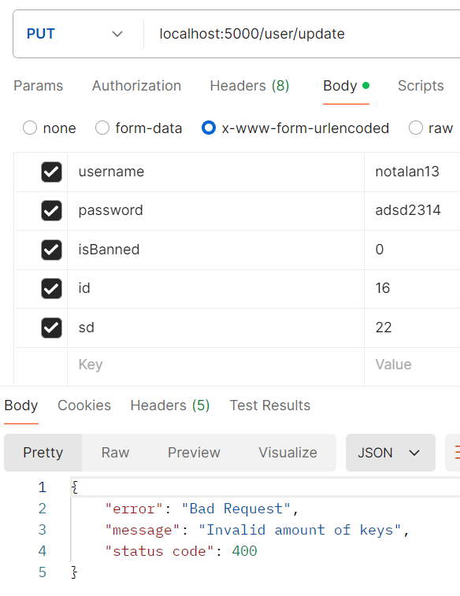

# Тестування працездатності системи

## Запуск сервера
 

## GET /users
 

## GET /user/\<id\>
 

## GET /user/\<id\> Error report
 

## GET /user/\<id\> Error report
 

## POST /user/add
 
 

## POST /user/add	Error report
 

## PUT /user/update
 
 

## PUT /user/update   Error report
 

## PUT /user/update   Error report
 

## PUT /user/update   Error report
 

## DELETE /user/delete/\<id\>
 
 

## DELETE /user/delete/\<id\>   Error report
 

## DELETE /user/delete/\<id\>   Error report
 

## BAN /user/ban/\<id\>
 
 

 ## UNBAN /user/unban/\<id\>
 
 

## ADD TO THE PROJECT /user/add/project
 
 

 ## DELETE OF THE PROJECT /user/delete/project/\<id\>
 
 
